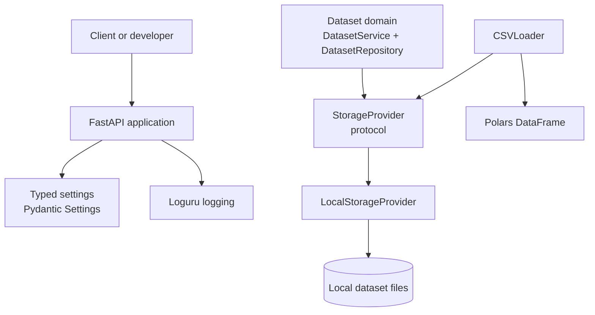

# Athena AI

**Athena AI** is an enterprise AI-native Data Intelligence Platform in active
early development. It currently provides a typed Python foundation for
registering local datasets and loading CSV data into Polars DataFrames.

The project is organized as a modular monolith with clean, provider-neutral
boundaries. It is intended to evolve incrementally from a dependable data
foundation rather than present unfinished capabilities as complete.

## Status

> **Early development — v0.1.0.** The implemented scope is the application
> foundation, local dataset registration, and CSV loading. Public dataset APIs,
> profiling, query execution, AI reasoning, and a web interface are not yet
> implemented.

Athena AI is suitable today for development and evaluation of its foundational
components. It should not yet be treated as a complete data catalog or
production data platform.

## Features

| Area | Available now |
| --- | --- |
| Application | FastAPI application factory with lifecycle support and system routes |
| Configuration | Environment-driven, typed settings using Pydantic Settings |
| Observability | Structured application logging configured with Loguru |
| Datasets | Registration service and durable SQLite dataset catalog |
| Storage | Provider-neutral `StorageProvider` protocol and local filesystem provider |
| Integrity | Streaming SHA-256 hashing for local storage assets |
| Loading | Provider-neutral CSV loader returning Polars DataFrames |
| Quality | Pytest coverage for storage, CSV loading, dataset services, and contracts |

## Architecture

Athena AI uses a **modular monolith**: related capabilities live in one Python
workspace, while modules communicate through explicit domain models and
interfaces. The current implementation follows Clean Architecture and
Domain-Driven Design practices in a deliberately lightweight form.

| Principle | Applied in the current codebase |
| --- | --- |
| Domain-centered design | Dataset models, status, registry, and service are grouped in `packages/domains/dataset`. |
| Dependency direction | Domain services depend on the `StorageProvider` protocol, not a specific storage implementation. |
| Provider neutrality | `LocalStorageProvider` is one adapter; loaders and services accept the storage interface. |
| Strong typing | Pydantic models, dataclasses, protocols, and strict mypy configuration express contracts. |
| Modular boundaries | Applications, core setup, domains, interfaces, storage, loaders, and shared code have separate packages. |



The API foundation currently exposes system information only. Dataset
registration and CSV loading are Python services; they are not yet exposed as
REST endpoints.

## Repository layout

```text
apps/
  api/                  FastAPI entry point, routes, and lifespan handling
datasets/
  sample/               Sample data used for local development
docs/                   Architecture, getting-started, development, and roadmap notes
packages/
  config/               Environment-backed application settings
  core/                 Application creation and logging setup
  domains/dataset/      Dataset models, registry, and registration service
  interfaces/           Provider-neutral protocols
  loaders/              CSV loading models and Polars-backed loader
  models/               Shared API and storage data models
  storage/blob/         Local filesystem storage provider
  shared/               Constants and shared exceptions
tests/                  Pytest test suite
```

Some workspace directories are scaffolding for future modules. Their presence
does not indicate that the corresponding capability is implemented.

## Technology stack

| Concern | Technology |
| --- | --- |
| Language | Python 3.12 |
| Dependency management | uv |
| Web foundation | FastAPI and Uvicorn |
| Configuration | Pydantic and pydantic-settings |
| Logging | Loguru |
| DataFrames and CSV parsing | Polars |
| Testing | pytest, pytest-asyncio, and pytest-cov |
| Code quality | Ruff and mypy |

## Quick start

### Prerequisites

- Python 3.12
- [uv](https://docs.astral.sh/uv/)

### Install dependencies

Clone the repository, enter the project directory, and synchronize the runtime
and development dependency groups:

```bash
uv sync --all-groups
```

### Configure the environment

Athena AI reads settings from environment variables and, when present, `.env`.
The built-in defaults run the API on port `8000` and use `datasets` as the local
storage root.

| Setting | Default | Purpose |
| --- | --- | --- |
| `APP_NAME` | `Athena AI` | Application title |
| `APP_DESCRIPTION` | `Autonomous Enterprise Data Intelligence Platform` | Application description |
| `APP_VERSION` | `0.1.0` | Application version |
| `HOST` | `0.0.0.0` | Server bind host |
| `PORT` | `8000` | Server bind port |
| `LOG_LEVEL` | `INFO` | Configured log level |
| `STORAGE_ROOT` | `datasets` | Root directory for local storage assets |
| `DATASET_CATALOG_PATH` | `data/athena.sqlite3` | Durable SQLite dataset catalog |
| `DATASET_QUERY_MEMORY_LIMIT` | `512MB` | DuckDB memory budget per query connection |
| `DATASET_QUERY_TIMEOUT_SECONDS` | `30` | Maximum query execution time in seconds |
| `DATASET_QUERY_MAX_ROWS` | `10000` | Maximum rows returned by the public query API |

Environment-variable names are case-insensitive. Unknown variables are ignored.

### Run the API

```bash
uv run uvicorn apps.api.main:app --reload
```

Verify the running application:

```bash
curl http://127.0.0.1:8000/health
curl http://127.0.0.1:8000/version
```

The FastAPI-generated API reference is available at
[`/docs`](http://127.0.0.1:8000/docs) while the server is running. The current
system routes are `/`, `/health`, and `/version`.

### Run tests

```bash
uv run pytest
```

Run the configured static checks when contributing changes:

```bash
uv run ruff check .
uv run mypy .
```

## Working with datasets

The current dataset workflow is service-oriented. A `DatasetService` combines a
storage provider with a durable SQLite-backed dataset repository; registration
inspects the referenced file, records its opaque retrieval reference, URI, size,
extension, and SHA-256 digest.

```python
from pathlib import Path

from packages.domains.dataset.service import DatasetService
from packages.storage.blob.local import LocalStorageProvider

storage = LocalStorageProvider(Path("datasets"))
datasets = DatasetService(storage)
dataset = datasets.register("sample/sales.csv")

print(dataset.name, dataset.sha256)
```

Use `CSVLoader` with the same provider to parse a provider-relative CSV asset
into a Polars `DataFrame`:

```python
from packages.loaders.csv import CSVLoader

result = CSVLoader(storage).load("sample/sales.csv")
print(result.dataframe)
```

The local provider rejects absolute references and references that resolve
outside the configured storage root. Dataset registrations are retained in the
SQLite catalog configured by `DATASET_CATALOG_PATH` (default:
`data/athena.sqlite3`) and survive application restart.

## Documentation

The README is an overview. Repository documentation is organized by topic:

| Topic | Starting point |
| --- | --- |
| Getting started | [Quick start](docs/getting-started/quick-start.md) and [first dataset](docs/getting-started/first-dataset.md) |
| Architecture | [Overview](docs/architecture/overview.md), [clean architecture](docs/architecture/clean-architecture.md), and [dependency rules](docs/architecture/dependency-rules.md) |
| Design decisions | [Architecture decision records](docs/adr/) |
| Development | [Setup](docs/development/setup.md), [testing](docs/development/testing.md), and [coding standards](docs/development/coding-standards.md) |
| Planning | [Roadmap](docs/roadmap/roadmap.md), [milestones](docs/roadmap/milestones.md), and [release plan](docs/roadmap/release-plan.md) |

## Roadmap

The following items are planned but not implemented in the current codebase:

| Area | Planned capability |
| --- | --- |
| Data ingestion | Excel and Parquet loaders |
| Data understanding | Dataset profiler |
| Query engine | DuckDB integration |
| Metadata | Metadata catalog |
| API | REST endpoints for datasets |
| Intelligence | Reasoning engine |
| Product interface | Web UI |

The roadmap describes direction, not delivery commitments. See the
[roadmap documentation](docs/roadmap/roadmap.md) for project planning material.

## Contributing

Contributions are welcome as the foundation develops. Before opening a change:

1. Read the relevant architecture and development documentation.
2. Keep dependencies directed through the established interfaces.
3. Add or update tests for changed behavior.
4. Run `uv run ruff check .`, `uv run mypy .`, and `uv run pytest`.
5. Keep commits focused and explain the change clearly.

The repository contains [contribution guidance](CONTRIBUTING.md), a
[code of conduct](CODE_OF_CONDUCT.md), and [security guidance](SECURITY.md).
These files are currently minimal; repository conventions and checks are the
most reliable source of development expectations.

## License

The repository includes a [LICENSE](LICENSE) file, but it does not currently
state license terms. Do not assume permission to use, redistribute, or modify
Athena AI beyond rights granted by applicable law until license terms are added.
