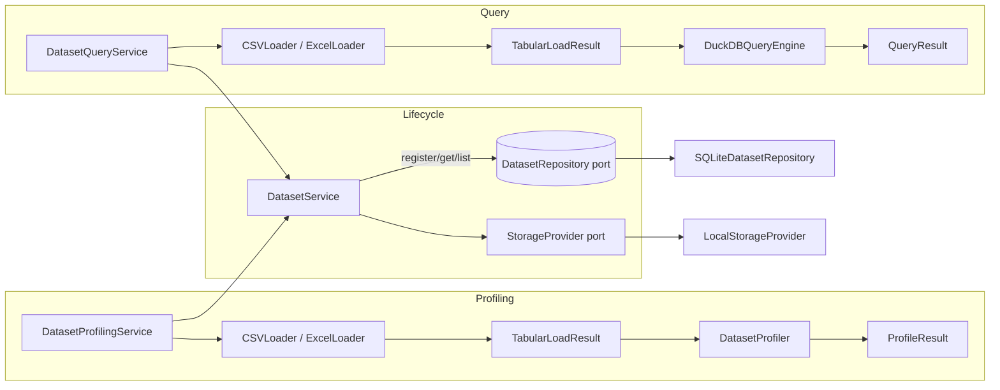
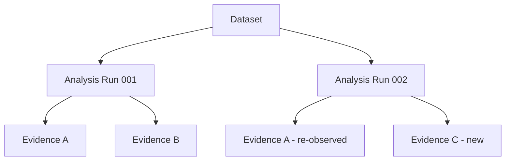
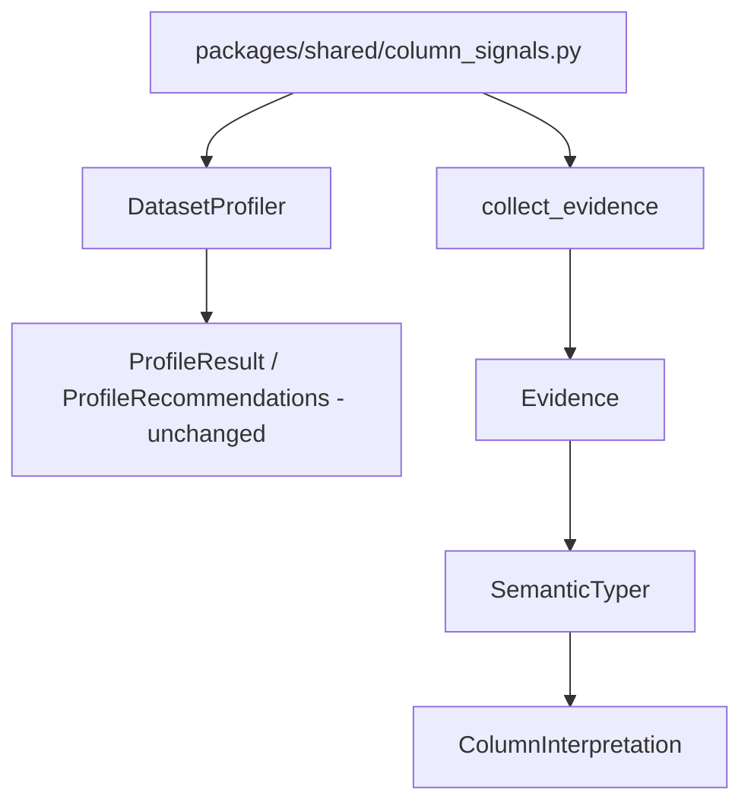
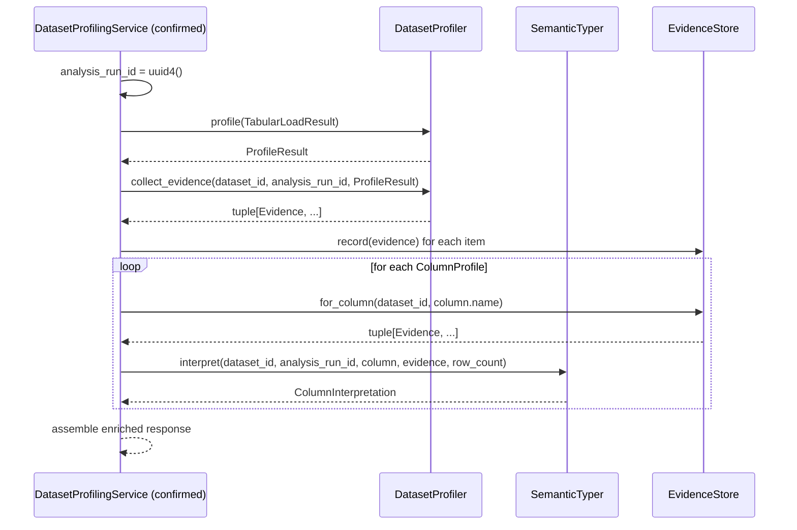

# ADR-0011 — Evidence-Based Semantic Discovery

## 1. Status

Accepted

## 2. Date

2026-08-13

## 3. Decision

Athena introduces **Evidence**, **Evidence Source**, **Provenance**,
**Analysis Runs**, **Confidence**, **Semantic Type**, and
**ColumnInterpretation** as first-class domain concepts, plus an
`EvidenceStore` port with an in-memory adapter and a deterministic
`SemanticTyper`. `DatasetProfiler` is extended, additively, to emit
`Evidence` from observations it already computes. `SemanticTyper` depends on
Evidence and neutral shared signals — never on `DatasetProfiler`'s private
methods. Nothing here performs relationship discovery, transformation
execution, entity resolution, or business reasoning. This ADR ends at
semantic interpretation; everything past that is a future ADR's foundation
to consume.

## 4. Context

Confirmed by the supplied repository material (including this round's new
files):

- `Dataset`, `DatasetStatus`, `DatasetService` in
  `packages/domains/dataset/`, backed by a `DatasetRepository` port and a
  `StorageProvider` port (ADR-0008, ADR-0009).
- `SQLiteDatasetRepository` as the durable catalog adapter (ADR-0009).
- `DatasetProfilingService` (`packages/services/` or equivalent — exact
  package path not shown by the supplied import lines, only the module
  content) — orchestrates `DatasetService.get()` → loader selection →
  `DatasetProfiler.profile()`, returning `ProfileResult` unchanged.
- `DatasetQueryService` — orchestrates `DatasetService.get()` → loader
  selection → `DuckDBQueryEngine.execute()`, enforcing the ADR-0010 row-limit
  policy.
- `DuckDBQueryEngine` — confirms ADR-0010's stated controls
  (`enable_external_access: false`, configurable `memory_limit`, a
  `Timer`-based interrupt for the execution timeout) are implemented exactly
  as ADR-0010 describes.
- `DatasetProfiler` (`packages/profiling/profiler.py`) — provider-independent,
  Polars-based, produces `ProfileResult` (`DatasetSummary`, tuple of
  `ColumnProfile`, `DataQualityProfile`, `ProfileRecommendations`).

**New confirmed fact this round — Section 18 (Loader Architecture) is now
answered.** `DatasetProfilingService._load` and `DatasetQueryService._load`
are near-identical: both branch on `dataset.source_type in {"csv"}` vs.
`{"xls", "xlsx"}`, construct a `CSVLoader`/`ExcelLoader` with the same
`storage_provider`, and raise the same `UnsupportedDatasetFormatError` on an
unrecognized format. This duplication is real, not speculative. It is
**not**, however, a blocker for this ADR: Evidence emission in this ADR
attaches only to the `DatasetProfilingService.profile()` path, and touching
`_load` in either service does not change Evidence's model or the
`EvidenceStore` port. It is recorded as a confirmed, optional prerequisite
cleanup candidate (see Non-Goals and Risks) rather than folded into this
ADR's Implementation Sequence, to avoid scope creep into an unrelated
refactor.

**Still not established by the supplied repository material:** the contents
of ADR-0001 through ADR-0007 (all supplied as empty files across both
rounds), `milestones.md`, `roadmap.md`, and — new this round — the
application/service layer files `chat_service.py`, `execution_service.py`,
`knowledge_service.py`, `memory_service.py`, and `planning_service.py`,
which were also supplied empty. Nothing in this ADR relies on their
contents. Any resemblance between this ADR's naming (e.g. "Chat", "Memory",
"Planning" as future Athena capabilities) and those filenames is
coincidental to the roadmap description in the task prompt, not backed by
inspected code.

`ColumnProfile` reports only physical observations. `ProfileRecommendations`
already performs deterministic semantic judgment (`identifier_columns`,
`date_dimensions`, etc.) via private heuristics inside `DatasetProfiler`,
with no observation trail, no confidence, and no way to say "I don't know."

## 5. Problem Statement

Athena needs a durable, structured distinction between **what it observed**
(a measured fact) and **what it interpreted** (a claim about meaning), with
every interpretation traceable back to the evidence that produced it, tagged
with who/what produced it, and explicit about how confident it is —
including the ability to say "insufficient evidence" instead of guessing.
Without this, later capabilities (relationship discovery, transformation
lineage, business reasoning) would have to invent their own ad hoc
observation/evidence trail, and user corrections would have no place to live
that's distinguishable from Athena's own inference.

## 6. Goals

- Evidence as an immutable, structured, auditable, append-only record of
  observation — never an unstructured value container.
- A clean separation between **what** was observed (`EvidenceType`), **who
  supplied it** (`EvidenceSource`: system vs. user), and **which specific
  producer/version** made the observation (`producer` string).
- A way to group Evidence by the analysis execution that produced it
  (`analysis_run_id`), without building a full versioning subsystem.
- A reusable Confidence/Uncertainty model, explicitly documented as
  heuristic scoring, not calibrated probability, including an explicit
  "insufficient evidence" outcome.
- A small, deterministic Semantic Type model and a `ColumnInterpretation`
  that cites its supporting evidence by ID.
- `SemanticTyper` decoupled from `DatasetProfiler`'s private implementation —
  it depends on Evidence and, where genuinely necessary, a neutral shared
  signals module, never on `DatasetProfiler._is_*` methods.
- Extend `DatasetProfiler` to emit Evidence from existing observations only,
  without changing its current behavior or signature.
- `EvidenceStore` port with an in-memory adapter.
- Preserve `ProfileResult` / `ProfileRecommendations` exactly as-is; every
  new capability is additive.
- Leave the model shape stable enough that relationship discovery,
  transformation lineage, and business reasoning can consume it later
  without restructuring Evidence, Confidence, or Provenance.

## 7. Non-Goals

| Deferred | Reason | Likely future ADR |
|---|---|---|
| Automatic relationship discovery | Consumes Evidence; not yet defined | Relationship Discovery ADR |
| Cross-dataset joins / dataset collections & workspaces | Requires relationship discovery first | Relationship Discovery / Dataset Collections |
| Multi-sheet Excel expansion | Requires revisiting dataset identity (1 file : N datasets) | Multi-Sheet Dataset Identity |
| Entity resolution | Depends on relationships existing first | Entity Resolution ADR |
| Automatic transformation execution | Needs reversibility & raw-preservation guarantees not yet designed | Transformation Lineage ADR |
| Business ontology, business reasoning | Needs semantic types + relationships first | Business Ontology ADR |
| Temporal/statistical reasoning, causal inference | Depend on the above | Temporal/Statistical/Causal ADRs |
| LLM semantic classification | `SemanticTyper` must stay deterministic | Not currently planned for the typer |
| Agentic workflows, vector/graph databases, distributed execution, enterprise connectors | No current consumer; core engine priority is data reasoning, not infrastructure | Out of scope for the core engine |
| Durable `EvidenceStore` | In-memory is sufficient until a consumer needs restart-survival | Durable Evidence Store ADR, mirroring ADR-0009 |
| Full dataset version management | `analysis_run_id` establishes only the boundary this needs | Dataset Versioning ADR |
| UI/dashboard work | Explicitly secondary per repository purpose | Out of scope |
| `DatasetLoader` extraction | Duplication between `DatasetProfilingService._load` and `DatasetQueryService._load` is now **confirmed**, but it is orthogonal to Evidence and not required to implement this ADR | Optional small refactor ADR, if prioritized |

## 8. Current Architecture

Confirmed by supplied material, including this round's additions:



`DatasetProfilingService.profile(dataset_id)` is the confirmed entry point
this ADR's Evidence emission attaches to. It already resolves a `Dataset`,
loads it, and calls `DatasetProfiler.profile()` — the Runtime Workflow
below extends exactly this method's call site, not a hypothetical one.

## 9. Architectural Principles

1. **Observation vs. Interpretation is the foundational split.**
2. **Evidence is append-only and structured**, never a free-form value —
   every field must be serializable and queryable.
3. **What was observed, who supplied it, and which producer/version made it
   are three separate dimensions** (`EvidenceType`, `EvidenceSource`,
   `producer`) and must not be collapsed into one.
4. **Evidence belongs to an analysis run.** Re-profiling never overwrites
   prior Evidence; it produces a new `analysis_run_id` and new Evidence.
5. **Confidence is a heuristic score, not a calibrated probability**, and
   must be able to say "insufficient evidence" rather than force a guess.
6. **Provenance is mandatory** on every Evidence item and every
   `ColumnInterpretation`.
7. **Additive, not replacing.** `ProfileResult` / `ProfileRecommendations`
   are untouched.
8. **No fabricated evidence, ever.** Every Evidence item must correspond to
   an actual computation a real producer performed. If no producer can
   support a claim, Athena returns `UNKNOWN` / `INSUFFICIENT`, not a
   confident-sounding guess. Concretely, this ADR does **not** emit — because
   no producer in the supplied repository material computes them — Excel
   serial-date evidence, value-range evidence, entropy evidence, currency
   evidence, geographic evidence, email-pattern evidence, phone-number
   evidence, customer/entity evidence, or any business-meaning evidence.
   Each requires a real detector before it can be added as an `EvidenceType`
   with a real producer (see Section 12); none is simulated or approximated
   in this ADR to make the model look more complete than the repository
   currently supports.
9. **Semantic interpretation must not depend on profiling internals.**
   `SemanticTyper` consumes `Evidence` and `ColumnProfile` (both public,
   stable models) — never `DatasetProfiler`'s private methods.
10. **No premature infrastructure.** No plugin framework, no model
    registry, no event bus, no graph/vector database, no LLM.

## 10. Observation vs Interpretation

Concrete example, `TxnLevel.csv`, column `Date`, physical type `Float64`,
value `46054` — this is the actual case the repository's real test data
exposed, and the current profiler correctly does **not** claim it is a date:

**Physical representation:** `46054`, `Float64`.

**Observation** (already computed by `DatasetProfiler` today): physical
type is `Float64`; `null_percentage` and `distinct_percentage` are whatever
`ColumnProfile` reports.

**Evidence** (this ADR, from confirmed observations only): a `DATA_TYPE`
evidence item, `source=SYSTEM`, `producer=profiler.v1`,
`details={"physical_type": "Float64"}`. **No `TEMPORAL_PATTERN` evidence is
emitted for this column in this ADR**, because no existing code detects
Excel-serial-date numeric ranges — emitting one would be fabricated
evidence (Principle 8).

**Interpretation:** `SemanticTyper` returns `semantic_type=UNKNOWN`,
`confidence=Confidence.insufficient()`, with a limitation noting no temporal
pattern detector currently exists for this column's value range.

**What this ADR establishes for the future** (not implemented here): the
architectural path by which a future `VALUE_RANGE`/Excel-serial detector
could turn this into `TEMPORAL_PATTERN` evidence → a `TEMPORAL` candidate
interpretation → a proposed (not executed) transformation. See Section 27
(Transformation Compatibility).

This is the same discipline applied everywhere: raw data → observation →
evidence → interpretation → confidence, never collapsing a later stage into
an earlier one.

## 11. Evidence Model

```python
# packages/domains/evidence/models.py

from dataclasses import dataclass
from datetime import datetime
from enum import StrEnum
from typing import Any
from uuid import UUID, uuid4


class EvidenceType(StrEnum):
    """WHAT was observed or asserted."""

    DATA_TYPE = "data_type"
    NULL_RATE = "null_rate"
    CARDINALITY = "cardinality"
    UNIQUENESS = "uniqueness"
    NAME_PATTERN = "name_pattern"
    VALUE_RANGE = "value_range"
    TEMPORAL_PATTERN = "temporal_pattern"
    DUPLICATE_PATTERN = "duplicate_pattern"


class EvidenceSource(StrEnum):
    """WHO/WHAT supplied the evidence — a dimension independent of type."""

    SYSTEM = "system"
    USER = "user"


@dataclass(frozen=True, slots=True)
class Evidence:
    """An immutable, structured, auditable observation."""

    id: UUID
    dataset_id: UUID
    analysis_run_id: UUID
    column_name: str | None  # None => dataset-level evidence
    evidence_type: EvidenceType
    source: EvidenceSource
    producer: str  # e.g. "profiler.v1", "semantic_typer.v1", "user.explicit"
    details: dict[str, Any]  # structured, serializable observation payload
    description: str  # human-explainable summary
    created_at: datetime

    @staticmethod
    def create(
        *,
        dataset_id: UUID,
        analysis_run_id: UUID,
        evidence_type: EvidenceType,
        source: EvidenceSource,
        producer: str,
        details: dict[str, Any],
        description: str,
        created_at: datetime,
        column_name: str | None = None,
    ) -> "Evidence":
        return Evidence(
            id=uuid4(),
            dataset_id=dataset_id,
            analysis_run_id=analysis_run_id,
            column_name=column_name,
            evidence_type=evidence_type,
            source=source,
            producer=producer,
            details=details,
            description=description,
            created_at=created_at,
        )
```

Key corrections from the prior draft:

- **`value: Any` is gone.** `details: dict[str, Any]` replaces it — a
  structured, key-value payload that is serializable, persistable, and
  queryable by field name, e.g.:

  ```python
  # NULL_RATE
  details = {"null_count": 0, "row_count": 373199, "null_percentage": 0.0}

  # CARDINALITY
  details = {"distinct_count": 65253, "row_count": 373199, "distinct_percentage": 17.48}

  # DATA_TYPE
  details = {"physical_type": "Float64"}
  ```

  Evidence must never become an arbitrary Python-object container; every
  producer is responsible for emitting JSON-serializable primitives in
  `details`.

**Immutability contract.** `frozen=True` prevents *reassigning* any field on
an `Evidence` instance (e.g. `evidence.details = {...}` raises), but it does
**not** recursively freeze the `details` dict itself — a caller could still
call `evidence.details["x"] = 1` in-place. This ADR does not introduce a
custom immutable-mapping type to close that gap; that would be
over-engineering for a repository with no established pattern for it. The
architectural contract is enforced by convention and code review, not by
the type system, and states:

- An `Evidence` record is immutable after creation.
- `Evidence` and `Evidence.details` must not be mutated by any application
  code after `Evidence.create()` returns.
- Producers construct the *complete* `details` payload at creation time —
  no producer emits an `Evidence` item and later appends or edits its
  `details`.
- A future durable `EvidenceStore` adapter may serialize `details` directly
  (e.g. as JSON) without needing any additional freezing mechanism.

**Serialization scope.** `Evidence.details` must contain only structured,
JSON-serializable values (`str`, `int`, `float`, `bool`, `None`, and nested
`dict`/`list` of the same) — this is a constraint on the *payload*, not on
the `Evidence` object as a whole. `Evidence` itself (the dataclass,
including its `UUID` and `datetime` fields) must be serializable by
whatever mechanism the application's normal persistence/serialization layer
already uses for comparable domain objects (e.g. Pydantic's model
serialization is used elsewhere in the repository for `Dataset`) — this ADR
does not require `Evidence` itself to be hand-serializable to JSON without
that layer. `created_at` remains a plain `datetime`; it is not replaced
with a string or epoch timestamp merely to simplify wording.

- **`USER_ASSERTION` is removed as an `EvidenceType`.** It was conflating
  *what* was observed with *who* observed it. A user telling Athena "UserId
  is the customer identifier" is still fundamentally a `NAME_PATTERN` or a
  new type entirely depending on what's being asserted — the thing that
  changes is `source=USER` and `producer=user.explicit`, not the evidence
  type taxonomy. This lets Athena represent, without ambiguity: Athena
  observed `NAME_PATTERN` evidence (`source=SYSTEM`, `producer=profiler.v1`)
  *and* a user separately asserted something about the same column
  (`source=USER`, `producer=user.explicit`) — both evidence items coexist,
  both are queryable, and downstream conflict resolution (deferred) can
  compare them directly.

## 12. Evidence Types

| Type | Backed by (confirmed today) | Example `details` |
|---|---|---|
| `DATA_TYPE` | `ColumnProfile.data_type` | `{"physical_type": "Float64"}` |
| `NULL_RATE` | `ColumnProfile.null_count`, `.null_percentage` | `{"null_count": 0, "row_count": 373199, "null_percentage": 0.0}` |
| `CARDINALITY` | `ColumnProfile.distinct_count`, `.distinct_percentage` | `{"distinct_count": 65253, "row_count": 373199, "distinct_percentage": 17.48}` |
| `UNIQUENESS` | `distinct_count == row_count` (derived, not separately stored) | `{"is_unique": true}` |
| `NAME_PATTERN` | Column-name heuristic (currently private to `DatasetProfiler`; extracted to a neutral module — see Section 19) | `{"matched_pattern": "suffix:_id"}` |
| `DUPLICATE_PATTERN` | `DataQualityProfile.duplicate_row_count` | `{"duplicate_row_count": 12, "duplicate_row_percentage": 0.003}` |
| `VALUE_RANGE` | **Not currently computed.** No min/max aggregation exists in `_profile_columns`. Listed because the Semantic Type Model needs it conceptually for `MEASURE`/`TEMPORAL` candidate reasoning, but it ships **only** once a real producer computes it (see Section 20). | n/a until implemented |
| `TEMPORAL_PATTERN` | Native `Date`/`Datetime` physical type only (`_is_date_dimension`-equivalent). **Not** emitted for numeric columns that merely resemble a date-serial range — that requires `VALUE_RANGE` first. | `{"physical_type": "Date"}` |

Every row in this table is either backed by a confirmed observation today or
explicitly marked as unbacked and deferred — no type is included on the
strength of "would be useful later" alone (Principle 8).

## 13. Evidence Source / Provenance

Two independent, deliberately separate concepts:

- **`EvidenceSource`** (`SYSTEM` | `USER`) — a closed, structural
  classification of *where* the observation originated. Used for filtering
  and for future conflict-resolution logic (e.g. "prefer `USER` evidence
  over `SYSTEM` evidence when they disagree" is a policy a future ADR can
  express *because* this distinction exists).
- **`producer`** — a free-form, versioned string identifying the specific
  component and version that generated the evidence: `profiler.v1`,
  `semantic_typer.v1`, `user.explicit`. Versioned so `profiler.v2` can
  coexist with historical `profiler.v1` evidence without ambiguity,
  consistent with the append-only principle.

Example from the corrections brief, now representable without collapsing
anything:

| Evidence | source | producer | evidence_type |
|---|---|---|---|
| Athena: "UserId → likely identifier, confidence 0.91" | — (this is a `ColumnInterpretation`, not raw Evidence) | `semantic_typer.v1` | n/a (interpretation, not evidence) |
| "UserId is an anonymized marketing identifier" | `USER` | `user.explicit` | future assertion type, TBD by a later ADR |
| "CustomerId is the canonical customer identity" | `USER` (business-ontology-sourced) | out of scope | deferred to Business Ontology ADR |

This ADR does not implement conflict resolution between these — it only
ensures the model can represent all three without merging them into one
record (Section 6 goal).

## 14. Analysis Runs

`Evidence.analysis_run_id: UUID` groups every Evidence item produced by one
profiling/analysis execution:



This ADR does **not** introduce an `AnalysisRun` entity, repository, or
persistence — only the `analysis_run_id: UUID` field on `Evidence` and the
convention that `DatasetProfilingService.profile()` generates one new
`analysis_run_id` (e.g. `uuid4()`) per invocation and threads it through
`collect_evidence()`. Evidence remains append-only: re-profiling a dataset
produces a new `analysis_run_id` and entirely new Evidence rows; it never
edits or deletes rows from a prior run. This is the minimum boundary needed
to later support re-profiling, drift detection, "what changed between runs,"
and reproducibility — without building a versioning subsystem now.

## 15. Confidence and Uncertainty

```python
# packages/domains/evidence/confidence.py

from dataclasses import dataclass
from enum import StrEnum


class ConfidenceLevel(StrEnum):
    HIGH = "high"
    MEDIUM = "medium"
    LOW = "low"
    SPECULATIVE = "speculative"
    INSUFFICIENT = "insufficient"  # Athena declines to classify


@dataclass(frozen=True, slots=True)
class Confidence:
    """A heuristic confidence score paired with its qualitative level.

    IMPORTANT: this is a heuristic weighting of deterministic evidence
    rules, NOT a calibrated statistical probability. `score=0.97` means
    "given the current evidence-weighting rules, this interpretation is
    highly supported" — it does NOT mean "97% probability of being
    correct." Calibration against real outcomes is future evaluation work,
    not part of this ADR.
    """

    score: float  # 0.0 - 1.0, heuristic weight — not a probability
    level: ConfidenceLevel

    _HIGH_THRESHOLD = 0.85
    _MEDIUM_THRESHOLD = 0.60
    _LOW_THRESHOLD = 0.35

    @staticmethod
    def from_score(score: float) -> "Confidence":
        if not 0.0 <= score <= 1.0:
            raise ValueError("Confidence score must be within [0.0, 1.0]")
        if score >= Confidence._HIGH_THRESHOLD:
            level = ConfidenceLevel.HIGH
        elif score >= Confidence._MEDIUM_THRESHOLD:
            level = ConfidenceLevel.MEDIUM
        elif score >= Confidence._LOW_THRESHOLD:
            level = ConfidenceLevel.LOW
        else:
            level = ConfidenceLevel.SPECULATIVE
        return Confidence(score=score, level=level)

    @staticmethod
    def insufficient() -> "Confidence":
        """'Athena declines to classify' — distinct from a low numeric score."""
        return Confidence(score=0.0, level=ConfidenceLevel.INSUFFICIENT)
```

Thresholds are centralized as named constants specifically so they can be
tuned in one place once real datasets are run through `SemanticTyper` and
without touching any call site. `Confidence.insufficient()` is the only path
to `INSUFFICIENT` — the typer must never manufacture a low score to avoid
returning it.

## 16. Semantic Type Model

```python
# packages/domains/evidence/semantic_types.py

from enum import StrEnum


class SemanticType(StrEnum):
    IDENTIFIER = "identifier"
    TEMPORAL = "temporal"
    MEASURE = "measure"
    CATEGORICAL = "categorical"
    TEXT = "text"
    UNKNOWN = "unknown"
```

`GEOGRAPHIC` is intentionally excluded — no producer in the repository
detects geographic characteristics. It is added alongside a real detector
when one exists, per the no-fabricated-evidence principle applied to
semantic types as well as evidence.

## 17. Column Interpretation

```python
# packages/domains/evidence/interpretation.py

from dataclasses import dataclass
from uuid import UUID

from packages.domains.evidence.confidence import Confidence
from packages.domains.evidence.semantic_types import SemanticType


@dataclass(frozen=True, slots=True)
class AlternativeInterpretation:
    semantic_type: SemanticType
    confidence: Confidence


@dataclass(frozen=True, slots=True)
class ColumnInterpretation:
    """Athena's current best interpretation of one column's meaning."""

    dataset_id: UUID
    analysis_run_id: UUID
    column_name: str
    semantic_type: SemanticType
    confidence: Confidence
    supporting_evidence_ids: tuple[UUID, ...]
    alternative_interpretations: tuple[AlternativeInterpretation, ...]
    producer: str
    limitations: tuple[str, ...] = ()
```

`supporting_evidence_ids` is the mechanism by which "Why did Athena classify
this column as an identifier?" is always answerable: trace each ID into
`EvidenceStore` and read the actual `details` that supported the call. A
`ColumnInterpretation` is never explainable by its score alone.

## 18. EvidenceStore

```python
# packages/interfaces/evidence_store.py

from typing import Protocol
from uuid import UUID

from packages.domains.evidence.models import Evidence


class EvidenceStore(Protocol):
    """Port for recording and retrieving immutable Evidence."""

    def record(self, evidence: Evidence) -> None:
        """Append one Evidence item. Never overwrites existing Evidence."""
        ...

    def for_dataset(self, dataset_id: UUID) -> tuple[Evidence, ...]:
        """All Evidence for a dataset, across every analysis run."""
        ...

    def for_column(self, dataset_id: UUID, column_name: str) -> tuple[Evidence, ...]:
        """All Evidence for one column of a dataset, across every run."""
        ...

    def for_analysis_run(self, analysis_run_id: UUID) -> tuple[Evidence, ...]:
        """All Evidence produced by one specific analysis run."""
        ...
```

```python
# packages/adapters/evidence/in_memory_evidence_store.py

from collections import defaultdict
from uuid import UUID

from packages.domains.evidence.models import Evidence


class InMemoryEvidenceStore:
    """Process-local EvidenceStore adapter. Not durable across restarts."""

    def __init__(self) -> None:
        self._by_dataset: dict[UUID, list[Evidence]] = defaultdict(list)

    def record(self, evidence: Evidence) -> None:
        self._by_dataset[evidence.dataset_id].append(evidence)

    def for_dataset(self, dataset_id: UUID) -> tuple[Evidence, ...]:
        return tuple(self._by_dataset.get(dataset_id, ()))

    def for_column(self, dataset_id: UUID, column_name: str) -> tuple[Evidence, ...]:
        return tuple(
            item for item in self._by_dataset.get(dataset_id, ())
            if item.column_name == column_name
        )

    def for_analysis_run(self, analysis_run_id: UUID) -> tuple[Evidence, ...]:
        return tuple(
            item
            for items in self._by_dataset.values()
            for item in items
            if item.analysis_run_id == analysis_run_id
        )
```

This mirrors the port+adapter, constructor-injection shape already
established by `DatasetRepository`/`SQLiteDatasetRepository` (ADR-0008,
ADR-0009). `EvidenceStore` is knowledge, not notification — it is
deliberately not an event bus. Durable persistence
(`SQLiteEvidenceStore`, mirroring ADR-0009) is deferred; no current consumer
needs restart-survival.

## 19. SemanticTyper

```python
# packages/domains/evidence/semantic_typer.py

from uuid import UUID

from packages.domains.evidence.confidence import Confidence
from packages.domains.evidence.interpretation import ColumnInterpretation
from packages.domains.evidence.models import Evidence
from packages.domains.evidence.semantic_types import SemanticType
from packages.profiling.models import ColumnProfile

PRODUCER = "semantic_typer.v1"


class SemanticTyper:
    """Deterministic, evidence-driven column semantic classification.

    Depends only on Evidence and ColumnProfile — never on DatasetProfiler's
    private heuristic methods. If shared signal logic is genuinely needed
    by both the profiler and the typer, it lives in a neutral module (see
    below), not inside DatasetProfiler.
    """

    def interpret(
        self,
        dataset_id: UUID,
        analysis_run_id: UUID,
        column: ColumnProfile,
        evidence: tuple[Evidence, ...],
        row_count: int,
    ) -> ColumnInterpretation:
        if not evidence:
            return ColumnInterpretation(
                dataset_id=dataset_id,
                analysis_run_id=analysis_run_id,
                column_name=column.name,
                semantic_type=SemanticType.UNKNOWN,
                confidence=Confidence.insufficient(),
                supporting_evidence_ids=(),
                alternative_interpretations=(),
                producer=PRODUCER,
                limitations=("no evidence available for this column",),
            )
        # Deterministic scoring over the supplied Evidence.details values.
        # Full scoring is an implementation detail of Step 5 (Implementation
        # Sequence); this ADR fixes inputs, outputs, dependency direction,
        # and provenance — not the exact weight of each rule.
        ...
```

**Input contract.** `SemanticTyper.interpret()` receives `dataset_id`,
`analysis_run_id`, `column: ColumnProfile`, `evidence: tuple[Evidence, ...]`,
and `row_count`. `ColumnProfile` is accepted only as **stable contextual
metadata** the interpretation operation needs to construct its output (the
column's `name`, for shaping `ColumnInterpretation.column_name`) — it is
**not** a second, independent source of semantic signal. `SemanticTyper`
must not derive a semantic claim (e.g. "this looks numeric, so score it as
a candidate `MEASURE`") directly from `ColumnProfile.data_type` or any other
`ColumnProfile` field; every semantic claim it makes must trace to a field
inside one of the supplied `Evidence` items' `details`. Concretely,
`SemanticTyper`:

- does **not** import `DatasetProfiler`;
- does **not** call any `DatasetProfiler` method, private or public;
- does **not** recreate profiler heuristics (`is_identifier_name`,
  `is_date_dimension`, etc.) internally;
- does **not** inspect raw Polars/pandas DataFrames;
- does **not** generate `Evidence` — it only consumes `Evidence` that
  `DatasetProfiler.collect_evidence()` already produced and the caller
  already recorded;
- consumes `Evidence` and (for identity/labeling purposes only)
  `ColumnProfile`;
- produces `ColumnInterpretation`.

**Dependency correction from the prior draft.** The previous version
suggested `SemanticTyper` reuse `DatasetProfiler._is_identifier_name`,
`_is_integer`, `_is_string`, `_is_date_dimension` directly. That is
rejected here: it would make semantic interpretation depend on profiling
implementation details, inverting the intended direction
(`DatasetProfiler → Evidence → SemanticTyper → ColumnInterpretation`).

Where the same underlying signal genuinely needs to be computed twice — once
inside `DatasetProfiler` to keep `ProfileRecommendations` backward
compatible, and once as the basis for `NAME_PATTERN`/type-shape Evidence —
that logic is extracted to a **neutral shared module** that both depend on,
rather than one depending on the other's internals:

```
packages/shared/column_signals.py
```

placed under `packages/shared/`, matching the existing, confirmed
`packages/shared/exceptions.py` convention (imported by both
`dataset_profiling_service.py` and `dataset_query_service.py` today) rather
than inventing a new top-level `packages/semantic/` namespace. It would hold
pure functions like `is_identifier_name(name: str) -> bool`,
`is_integer(dtype: str) -> bool`, `is_date_dimension(dtype: str) -> bool` —
the exact same rules that exist today, relocated and made importable by
both `DatasetProfiler` (which keeps using them to build
`ProfileRecommendations`, unchanged) and the new `NAME_PATTERN`-evidence
emission in `collect_evidence`. `SemanticTyper` itself still does not import
`column_signals` for its own scoring — it scores from `Evidence.details`,
which is where those signals' results already land once emitted. This keeps
the dependency graph exactly as required:



`SemanticTyper` is a plain class, not a plugin/registry. It is pure with
respect to its inputs: same `ColumnProfile` + same `Evidence` tuple + same
`row_count` → identical `ColumnInterpretation`. If no evidence applies, it
returns `UNKNOWN` + `Confidence.insufficient()` — never a fabricated low
score.

## 20. Profiler Integration

`DatasetProfiler.profile()` keeps its exact current signature and behavior.
A new method is added alongside it:

```python
def collect_evidence(
    self,
    dataset_id: UUID,
    analysis_run_id: UUID,
    result: ProfileResult,
) -> tuple[Evidence, ...]:
    """Translate an already-computed ProfileResult into Evidence items."""
```

It reads only fields already present on `ProfileResult` — no new dataframe
computation, so it cannot fabricate an observation `DatasetProfiler` didn't
already make. Per column, it emits:

- `DATA_TYPE` from `column.data_type`
- `NULL_RATE` from `column.null_count` / `column.null_percentage`
- `CARDINALITY` from `column.distinct_count` / `column.distinct_percentage`
- `UNIQUENESS`, *only if* `distinct_count == row_count`
- `NAME_PATTERN`, *only if* `column_signals.is_identifier_name(column.name)`
  is true — no evidence is emitted for a negative observation
- `TEMPORAL_PATTERN`, *only if* the column's physical type is a native
  date/datetime type

At the dataset level: `DUPLICATE_PATTERN` from
`DataQualityProfile.duplicate_row_count`.

`DatasetProfiler` does not depend on `EvidenceStore` — it returns Evidence;
recording is the caller's (`DatasetProfilingService`'s) responsibility. This
keeps `DatasetProfiler` free of new dependencies and as easily unit-testable
as it is today.

**Explicitly not implemented in this ADR:** `VALUE_RANGE` evidence and any
Excel-serial-date / representation detection. No min/max aggregation exists
in `_profile_columns` today. Section 27 below establishes the architectural
path this capability will follow when it is built — it is classified as an
important **future P0 capability**, not an incidental limitation, per the
corrections to this ADR.

## 21. Runtime Workflow



Unlike the previous draft, the caller here is named with confidence:
`DatasetProfilingService.profile()` is confirmed source, and this workflow
extends its existing call to `DatasetProfiler.profile()` in place, adding
the Evidence/interpretation steps immediately after. `DatasetQueryService`
is unaffected — it has no reason to record Evidence.

## 22. API Compatibility

Existing conceptual endpoints, per ADR-0008, are unaffected:

```
POST /api/v1/datasets
GET  /api/v1/datasets
GET  /api/v1/datasets/{dataset_id}
POST /api/v1/datasets/{dataset_id}/profile
```

No source for the actual FastAPI route handling `/profile` was supplied in
any round, so this ADR cannot confirm its current response model — only
that `DatasetProfilingService.profile()` returns `ProfileResult` today.

Two distinct things must not be conflated:

**A. `ProfileResult` (existing, domain-level)** — unchanged by this ADR.
`DatasetSummary`, `ColumnProfile`, `DataQualityProfile`, and
`ProfileRecommendations` keep their current fields and semantics exactly.
`interpretations` is **not** added to `ProfileResult`; nothing in the
supplied repository material requires or justifies changing that domain
model.

**B. The API response (wrapping, presentation-level)** — where a route
wraps `ProfileResult` for the public API, an optional additive field may be
introduced there: *the existing `ProfileResult` fields and semantics remain
unchanged; where the API response model wraps `ProfileResult`, an optional
additive `interpretations` field may expose `ColumnInterpretation`
results.* No existing field is removed, renamed, or reinterpreted at either
level.

## 23. User-Provided Knowledge

This ADR defines `EvidenceSource.USER` and `producer="user.explicit"` so a
future explicit-instruction API can record user input as Evidence,
distinguishable in *source* from `EvidenceSource.SYSTEM` evidence, without
needing a separate `EvidenceType` for the fact that it came from a user (see
Section 11's correction). It does not implement an API endpoint for
submitting assertions, nor conflict resolution between `user.explicit` and
`semantic_typer.v1` interpretations of the same column — both explicitly
deferred.

## 24. Multi-Dataset Compatibility

`Evidence.dataset_id` and `ColumnInterpretation.dataset_id` key every record
to one `Dataset.id` (ADR-0008 identity) — never to a filename, and never to
a pair of datasets. This is the specific property a future relationship
discoverer needs: it can call
`EvidenceStore.for_column(dataset_id, "UserId")` independently for
`UserLevel.csv`'s `Dataset.id` and `TxnLevel.csv`'s `Dataset.id`, compare
the two `ColumnInterpretation`s it derives, and propose a candidate
`FOREIGN_KEY` / `MANY_TO_ONE` relationship backed by:

- both columns' `SemanticType` (`IDENTIFIER` on both sides),
- physical-type compatibility (from `DATA_TYPE` evidence on both),
- uniqueness of the target side (`UNIQUENESS` evidence on `UserLevel.UserId`),
- cardinality/null behavior of the source side (`CARDINALITY`/`NULL_RATE`
  evidence on `TxnLevel.UserId`),
- naming similarity (both `NAME_PATTERN`-matched on `UserId`).

Value overlap and referential coverage (actually comparing the two columns'
*values*, not just their evidence) are **not** derivable from
`ColumnInterpretation` alone — they require reading both dataframes
together, which is squarely the future Relationship Discovery ADR's job,
not this one's. This ADR's contribution is only that every other signal
above is already structured, typed, and independently retrievable per
`dataset_id`, with no restructuring required to consume it across datasets.

## 25. Multi-Sheet Compatibility

`Evidence` and `ColumnInterpretation` are scoped to `dataset_id`, not to a
file — no model here assumes "one file = one dataset forever." If a future
ADR changes dataset identity to register one Excel file as multiple
`Dataset`s (one per sheet), each derived `Dataset.id` simply accumulates its
own Evidence independently; no change to this ADR's models is required.
Multi-sheet expansion itself is not implemented here.

## 26. Relationship Discovery Compatibility

Covered concretely in Section 24. This ADR implements no comparison logic —
only ensures `EvidenceStore` and `ColumnInterpretation` are queryable across
`dataset_id`s by a future `future.relationship_discoverer` producer without
structural change.

## 27. Transformation Compatibility

This ADR does not implement transformation execution or a
`TransformationRecord` model, but explicitly establishes the path a future
Transformation Lineage ADR must follow, using the repository's real Excel
serial-date case as the concrete example:

```mermaid
flowchart LR
    A[Physical representation: 46054, Float64] --> B[Pattern detection: future VALUE_RANGE producer]
    B --> C[Evidence: VALUE_RANGE / TEMPORAL_PATTERN]
    C --> D[Semantic candidate: TEMPORAL, via SemanticTyper]
    D --> E[Confidence: heuristic score]
    E --> F["Transformation recommendation: possible Excel serial-date conversion"]
    F --> G[Future user/policy approval]
    G --> H[Transformation execution - NOT this ADR]
    H --> I[Transformation lineage record - NOT this ADR]
```



Robust representation detection (Excel serial dates, numeric-string
currencies, mixed date formats, unit normalization, category-spelling
variants) is classified here as an **important future P0 capability** —
consistent with the roadmap's P0 priorities — not as an incidental gap in
this ADR. The architectural guarantee this ADR makes for that future work:
no model introduced here mutates, normalizes, or replaces a column's
underlying values; `Evidence` and `ColumnInterpretation` remain purely
descriptive. A future `TransformationRecord` can reference `Evidence` and
`ColumnInterpretation` by ID the same way `ColumnInterpretation` already
references `Evidence` by ID, and must itself guarantee: raw representation
preserved, normalized representation, transformation metadata, supporting
evidence, and reversibility where possible. None of that model is defined
in this ADR.

## 28. Opaque / Encrypted Data

When no evidence type applies — no name pattern, no native temporal type,
no clear numeric/categorical signal — `SemanticTyper.interpret` returns
`UNKNOWN` + `Confidence.insufficient()` rather than guessing. High-entropy
strings, tokens, and hashes fall into this path today because no entropy
detector exists in the repository; adding one is future work for a new
`EvidenceType` with a real producer, not a special case hardcoded into the
typer.

## 29. Business Understanding Compatibility

Out of scope. This ADR's only contribution toward eventual business
understanding is that `Evidence`/`ColumnInterpretation` keep statistical
observation structurally separate from any business label — no business-
interpretation model is introduced here, and none of the repository's
supplied code currently computes anything business-contextual (e.g.
percentile-outlier detection) for this ADR to build on.

## 30. Security Considerations

- `Evidence.details` is a structured dict of counts, percentages, and
  matched-pattern strings (see Section 12's table) — it never stores raw
  cell values in this ADR, so it introduces no new PII exposure beyond what
  `ColumnProfile` already exposes today. A future `EvidenceType` that stores
  literal sample values must separately address data handling and
  retention.
- `EvidenceStore` is in-memory and process-local — no new persistence
  surface, no new durability guarantee, same profile as pre-ADR-0009
  `Dataset` storage.
- No authentication/authorization model is introduced or assumed; Evidence
  access follows whatever boundary already governs `ProfileResult` access.

## 31. Risks

- **Confidence threshold miscalibration.** 0.85/0.60/0.35 are heuristic
  starting points, not validated against real data. Mitigated by
  centralizing them as named constants on `Confidence`.
- **Divergence between `ProfileRecommendations` and
  `ColumnInterpretation`.** Both exist side by side and could disagree.
  Mitigated by extracting shared signal logic (`is_identifier_name`, etc.)
  into `packages/shared/column_signals.py` so both consumers compute from
  the same rules — not eliminated by this ADR alone; should be covered by
  an explicit regression test (Testing Strategy).
- **Confirmed loader duplication left unaddressed.** `_load` in
  `DatasetProfilingService` and `DatasetQueryService` is now confirmed
  duplicated. Leaving it as-is is a deliberate scope decision for this ADR,
  not an oversight — but it should be tracked, since evidence emission adds
  a second reason (beyond query support) to eventually extract a shared
  `DatasetLoader`.
- **`analysis_run_id` without an `AnalysisRun` entity.** Nothing currently
  validates that an `analysis_run_id` used on `Evidence` corresponds to a
  real, completed run — there is no run registry in this ADR. Acceptable
  for the current scope; a future Dataset Versioning ADR should decide
  whether that validation is worth adding.
- **`VALUE_RANGE`/temporal-pattern gap.** The Excel-serial-date example
  cannot be evidenced yet. Explicitly flagged (Sections 12, 20, 27) rather
  than silently left out, per source discipline.

## 32. Alternatives Considered

**A — Put evidence directly inside `ProfileResult`.** Rejected: conflates
an append-only audit trail with a point-in-time snapshot; breaks the
"`ProfileResult` unchanged" goal.

**B — Store evidence only as logs.** Rejected: not queryable by
`dataset_id`/`column_name`/`analysis_run_id` without a parsing layer.

**C — Use an event bus as the evidence mechanism.** Rejected: Evidence is
knowledge to be queried, not a notification to be delivered.

**D — Store everything in a graph database immediately.** Rejected:
premature infrastructure; relationship discovery, the first real graph-
shaped consumer, is out of scope here.

**E — Use an LLM as the primary semantic classifier.** Rejected: the first
`SemanticTyper` must be deterministic and reproducible.

**F — Build a generic plugin architecture immediately.** Rejected: one
producer (`profiler.v1`) and one typer (`semantic_typer.v1`) do not justify
a plugin system.

**G — Skip evidence and directly implement relationship discovery.**
Rejected: relationship discovery needs exactly this foundation first.

**H — Keep `Evidence.value: Any` for implementation simplicity.** Rejected
per this round's corrections: an untyped container is not reliably
serializable, persistable, or queryable, and defeats the auditability goal.

**I — Fold `EvidenceSource` into `EvidenceType` (e.g. a `USER_ASSERTION`
type).** Rejected per this round's corrections: it conflates two
independent dimensions and would make future source-based conflict
resolution (system vs. user vs. ontology) awkward to express.

## 33. Implementation Sequence

**Step 0 — Prerequisite refactoring.** Not authorized by this ADR. The
confirmed `_load` duplication in `DatasetProfilingService`/
`DatasetQueryService` is tracked (Risks) but intentionally left for a
separate, optional refactor decision — it does not block any step below.

**Step 1 — Evidence, Confidence, Semantic, Interpretation models.**
`packages/domains/evidence/{models,confidence,semantic_types,interpretation}.py`
as specified. Independently testable in isolation, no dependents yet.

**Step 2 — EvidenceStore.**
`packages/interfaces/evidence_store.py` (Protocol) +
`packages/adapters/evidence/in_memory_evidence_store.py`. Testable against
the Protocol contract alone.

**Step 3 — Neutral shared signals.**
Extract `is_identifier_name`, `is_integer`, `is_string`,
`is_date_dimension` from `DatasetProfiler` into
`packages/shared/column_signals.py` as pure functions; have
`DatasetProfiler` import and delegate to them (behavior-preserving — same
inputs, same outputs, verified by the existing `ProfileRecommendations`
tests). This is the step that makes Step 5 possible without
`SemanticTyper` touching `DatasetProfiler` internals.

**Step 4 — Profiler evidence emission.**
Add `DatasetProfiler.collect_evidence(dataset_id, analysis_run_id, result)`,
using `column_signals` from Step 3 for `NAME_PATTERN` detection. `VALUE_RANGE`
is explicitly **not** included in this step (see Section 20) — ships only
when a real min/max producer is separately justified and implemented.

**Step 5 — SemanticTyper.**
Implement `SemanticTyper.interpret()` fully, scoring from `Evidence.details`
only — no import of `DatasetProfiler` or `column_signals` inside the typer
itself.

**Step 6 — `DatasetProfilingService` integration.**
Generate `analysis_run_id = uuid4()` per `profile()` call; call
`collect_evidence`, record into `EvidenceStore`, call `SemanticTyper.interpret`
per column, per the confirmed Runtime Workflow (Section 21). This is now a
concrete, reviewable diff against real source, not a hypothetical one.

**Step 7 — Backward-compatible API enrichment.**
Add the optional `interpretations` field wherever `ProfileResult` is
currently surfaced by the (unsupplied) FastAPI route.

**Step 8 — Testing and regression validation.**
Per Testing Strategy below; run `uv run ruff check .`, `uv run mypy apps
packages tests`, `uv run pytest`, confirming the existing baseline is
unchanged, per the validation principle already established in ADR-0008.

Each step is independently reviewable, backward compatible, and free of
speculative infrastructure beyond what the step itself requires.

## 34. Testing Strategy

**Evidence**
- Distinct `id` per construction; immutability of identity.
- Correct `dataset_id` / `column_name` / `analysis_run_id` scoping.
- `InMemoryEvidenceStore.for_dataset`, `for_column`, `for_analysis_run` each
  return only matching items.
- Recording evidence never mutates or removes prior evidence (append-only).

**Confidence**
- `Confidence.from_score` raises outside `[0.0, 1.0]`.
- Boundary values (`0.85`, `0.60`, `0.35`) map to the correct
  `ConfidenceLevel`.
- `Confidence.insufficient()` always returns `INSUFFICIENT`, never a
  numeric level.

**SemanticTyper**
- Strong `NAME_PATTERN` + `UNIQUENESS` + zero `NULL_RATE` evidence →
  `IDENTIFIER` + `HIGH`.
- Native date/datetime `DATA_TYPE` evidence → `TEMPORAL`.
- Low-cardinality string column → `CATEGORICAL`.
- Numeric, non-identifier column → `MEASURE`.
- No applicable evidence → `UNKNOWN` + `Confidence.insufficient()`, never a
  fabricated low score.
- `alternative_interpretations` populated when a second type is plausible.
- Same `ColumnProfile` + same `Evidence` tuple → identical
  `ColumnInterpretation` across repeated calls (determinism).
- `SemanticTyper` module has no import of `DatasetProfiler` (dependency
  direction enforced by a static import check, not just review).

**Profiler**
- `DatasetProfiler.profile()` output is unchanged by this ADR (regression
  test against pre-ADR fixtures).
- Every `Evidence` item from `collect_evidence` traces to a field actually
  present on the `ProfileResult` passed in.
- A column with no identifier name pattern produces no `NAME_PATTERN`
  evidence (no evidence for a negative observation).
- Every `Evidence` item from one `collect_evidence` call shares the same
  `analysis_run_id`.
- `column_signals` functions, after extraction (Step 3), produce identical
  results to the pre-extraction private methods (behavior-preserving
  refactor test).

**API**
- Existing profiling response fields remain present and unchanged.
- The new `interpretations` field is additive; clients ignoring it are
  unaffected.

**Regression**
- `uv run ruff check .`, `uv run mypy apps packages tests`, `uv run pytest`
  all pass with no new failures.

## 35. Acceptance Criteria

- Evidence is recorded with `dataset_id`, `analysis_run_id`, optional
  `column_name`, `evidence_type`, `source`, `producer`, and structured
  `details` — never an untyped value.
- `EvidenceType`, `EvidenceSource`, and `producer` remain three independent
  dimensions; no `USER_ASSERTION` evidence type exists; user-originated
  evidence is represented only via `source=USER`, `producer=user.explicit`.
- Every Evidence item corresponds to a real, confirmed observation; none is
  emitted speculatively (verified by the Profiler test above); none of the
  explicitly excluded signal categories in Principle 8 are fabricated.
- `Evidence` is treated as immutable by convention (no field reassignment,
  no in-place mutation of `details` after creation) — understood as an
  architectural contract enforced by code review, not a claim that
  `frozen=True` recursively freezes `details`.
- `ColumnInterpretation` cites its supporting Evidence by ID; no
  interpretation is unexplainable.
- Confidence is always explicit, documented as a heuristic support score
  (not a calibrated probability), and can be `INSUFFICIENT`, distinct from
  a low numeric score.
- `SemanticTyper` has zero dependency on `DatasetProfiler` — verified by an
  import check — and derives every semantic claim from `Evidence.details`,
  never directly from `ColumnProfile`.
- Existing `ProfileResult` output, including `ProfileRecommendations`, is
  unchanged; `interpretations` is additive only at the API-response layer,
  never merged into or replacing `ProfileResult`.
- No LLM is required anywhere in this ADR's implementation.
- No relationship discovery, transformation execution, entity resolution,
  or business reasoning is implemented.
- Raw dataframe values are never mutated by anything introduced here.
- The architecture supports a future relationship discoverer and a future
  transformation engine without structural change (Sections 24, 26, 27).
- The `analysis_run_id` boundary supports future re-profiling/drift
  detection without a versioning subsystem existing yet.
- All existing tests remain green.

## 36. Future ADR Boundaries

```
Profiling
   -> Evidence
   -> Semantic Interpretation      <-- this ADR ends here
   -> Relationship Discovery
   -> Entity Resolution
   -> Temporal / Statistical Reasoning
   -> Business Understanding
   -> Causal / Recommendation Systems
```

- **Relationship Discovery ADR** — consumes `EvidenceStore` and
  `ColumnInterpretation` across `dataset_id`s (Section 24); introduces
  `future.relationship_discoverer`.
- **Transformation Lineage ADR** — introduces `TransformationRecord`
  (Section 27); must guarantee raw recoverability.
- **Durable Evidence Store ADR** — persistent `EvidenceStore` adapter,
  mirroring ADR-0009, once a real consumer needs restart-survival.
- **Dataset Versioning ADR** — a real `AnalysisRun` entity/registry, built
  on the `analysis_run_id` boundary established here (Section 14).
- **Optional Loader Refactor ADR** — extracting `DatasetLoader` from the
  now-confirmed duplication in `DatasetProfilingService`/
  `DatasetQueryService`, if prioritized independently of Evidence work.

## 37. Final Decision

Adopt `Evidence` (with `details: dict[str, Any]`, `analysis_run_id`, and a
separate `EvidenceSource`), `Confidence` (explicitly heuristic, with
`INSUFFICIENT`), `SemanticType`, `ColumnInterpretation`, and `EvidenceStore`
as specified. Extend `DatasetProfiler` additively via `collect_evidence()`,
backed only by confirmed observations. Extract shared signal logic to
`packages/shared/column_signals.py` so `SemanticTyper` never depends on
`DatasetProfiler` internals. Implement one deterministic `SemanticTyper`.
Keep `ProfileResult`/`ProfileRecommendations` unchanged, with any new
`interpretations` field introduced only at the API-response layer, never
inside `ProfileResult` itself. Treat `Evidence` immutability as an
architectural contract enforced by convention, not by a claim that
`frozen=True` deep-freezes `details`. Constrain `SemanticTyper`'s inputs so
`ColumnProfile` is contextual metadata only and every semantic claim traces
to `Evidence.details`. Wire into the confirmed
`DatasetProfilingService.profile()` call site. Defer everything in
Non-Goals to later ADRs. **Status: Accepted.** This is the foundation layer
only, and it is ready for implementation starting at Step 1 of the
Implementation Sequence.
